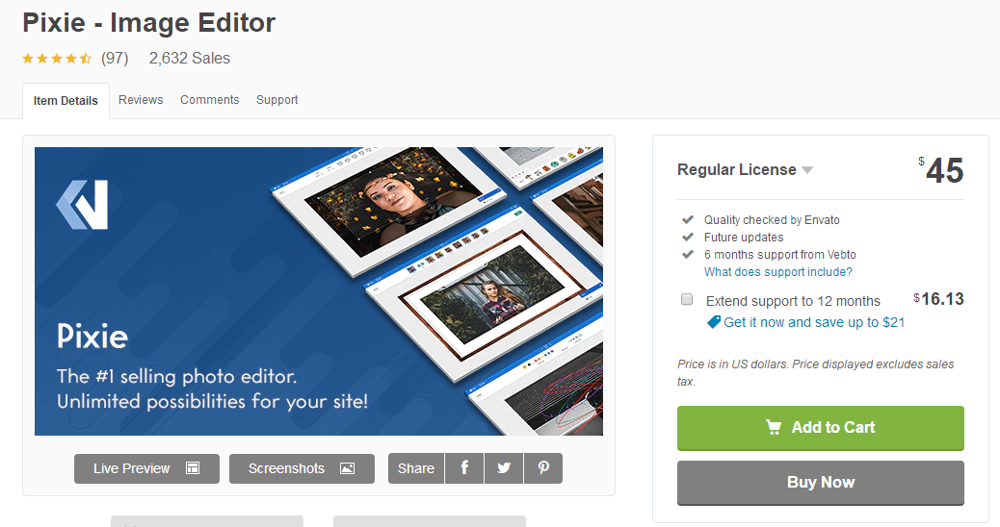
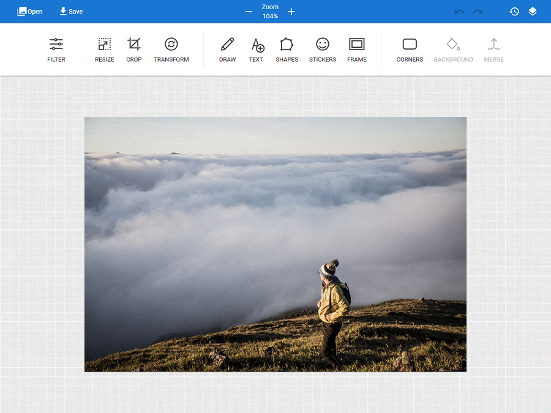
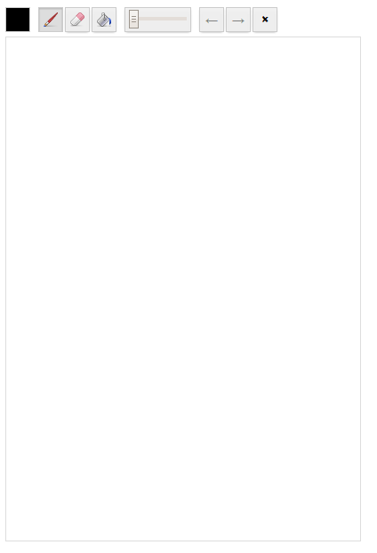
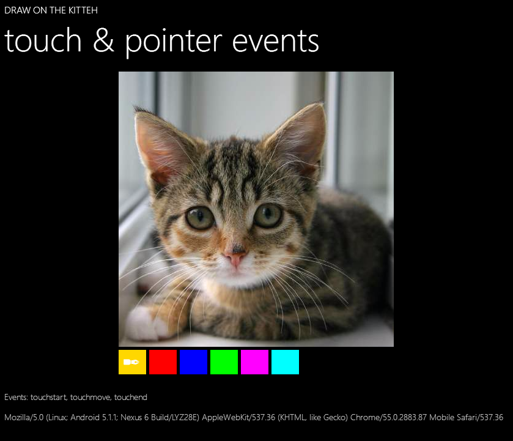
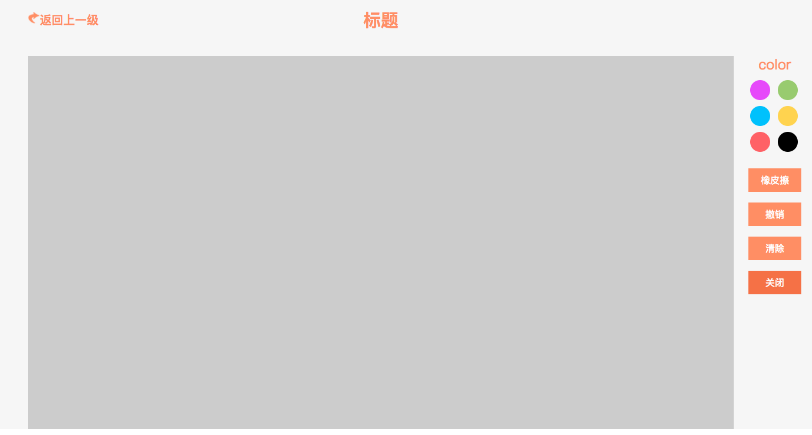
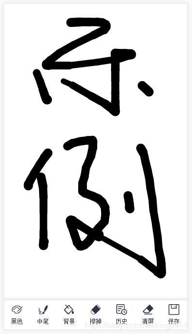
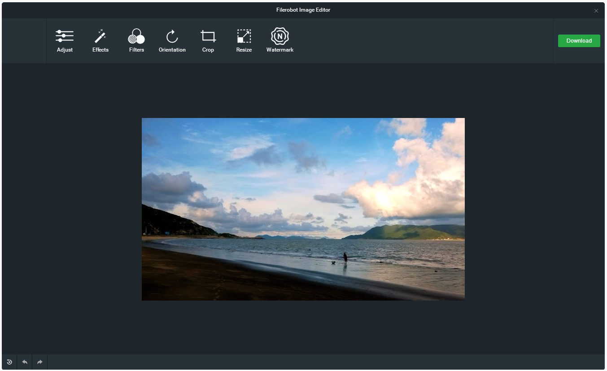
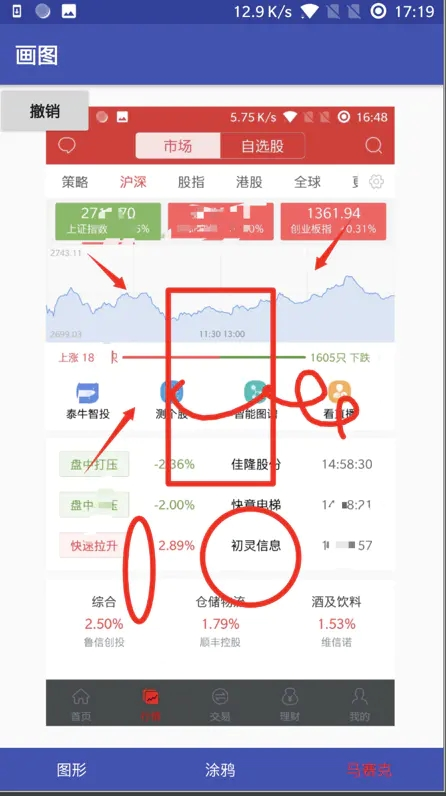

# H5涂鸦大集合

> 部门有个需求是做图片在线处理,最基础的功能就是要有涂鸦功能进行图片标记,于是调研了在线涂鸦的JS插件

## 1 Pixie Image Editor

#### 功能强大 收费软件
- 滤镜
- 缩放
- 裁剪
- 旋转
- 涂鸦
- 添加文字
- 添加标识
- 添加图标
- 添加图框
- 圆角
- 背景色
- 图片合并
- 撤销,重绘
- 历史记录

#### 演示地址

[演示地址](https://preview.codecanyon.net/item/pixie-image-editor/full_screen_preview/10721475)
[中文演示地址](https://www.iloveimg.com/zh-cn/photo-editor)

## 2 drawingboard.js
[https://github.com/Leimi/drawingboard.js](https://github.com/Leimi/drawingboard.js)

```
<div id="zbeubeu"></div>

<style>
	#zbeubeu {
		width: 400px;
		height: 600px;
	}
</style>

<script>
	var myBoard = new DrawingBoard.Board('zbeubeu');
</script>
```
#### 功能点
- 涂鸦
- 擦除
- 背景填充
- 撤销,重绘
- 清屏

#### 演示
[drawingboard demo](demo/html/drawingboard.html)

## 3 Draw On The Kitteh
[http://www.100sucai.com/demos.php?id=1557627826](http://www.100sucai.com/demos.php?id=1557627826)

#### 演示
[draw_on_the_kitteh demo](demo/html/draw_on_the_kitteh.html)

## 4 H5涂鸦canvas
[https://www.cnblogs.com/xiaochongchong/p/7833777.html](https://www.cnblogs.com/xiaochongchong/p/7833777.html)

#### 功能点
- 涂鸦
- 擦除
- 清屏
#### 演示
[H5_draw_canvas demo](demo/html/H5_draw_canvas.html)

## 4 canvas draw
[https://blog.csdn.net/king0964/article/details/88819598](https://blog.csdn.net/king0964/article/details/88819598)

> 博文中的代码仅实现移动端涂鸦部分,如果需要其他功能需要自行丰富

#### 演示
[canvas draw demo](demo/html/canvas_draw.html)

## 5 vue涂鸦组件
[https://segmentfault.com/a/1190000016852958](https://segmentfault.com/a/1190000016852958)
> 不会vue没试过,详情请查看链接

## 6 filerobot-image-editor
[https://github.com/scaleflex/filerobot-image-editor](https://github.com/scaleflex/filerobot-image-editor)
> 这个图片编辑器没有涂鸦功能,不过做的很好值得推荐一下

#### 功能点
- 调节亮度,对比度,曝光值,饱和度
- 滤镜
- 旋转
- 裁剪
- 缩放
- 图片水印
- 撤销,重绘
- 保存文件

> 可惜没有涂鸦功能

#### 演示
[filerobot-image-editor demo](demo/html/firerobot_image_editor.html)

## 7 Android 编辑图片
[https://www.jianshu.com/p/f27b67803e00](https://www.jianshu.com/p/f27b67803e00)

> 拥有图形,涂鸦,马赛克功能,不会安卓不做演示了,会的自己看博文及源码

## 8 原生js和canvas写的一个移动端图片编辑器
[https://github.com/lijibing01/picture_edit](https://github.com/lijibing01/picture_edit)
#### 功能点
- 涂鸦
- 文字
- 撤回
- 清屏
#### 不足之处
- 涂鸦不支持笔触及颜色(可能需要进一步开发)
- 文字样式单一(背景白色,不是透明背景)
- 撤销无法撤销文字
#### 演示地址
[http://www.xiaomooo.cn:8080/dist/](http://www.xiaomooo.cn:8080/dist/)
